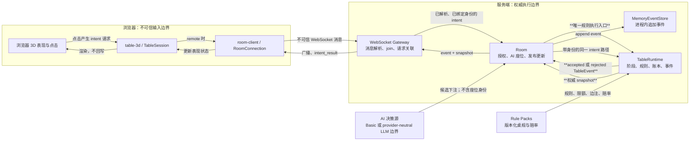
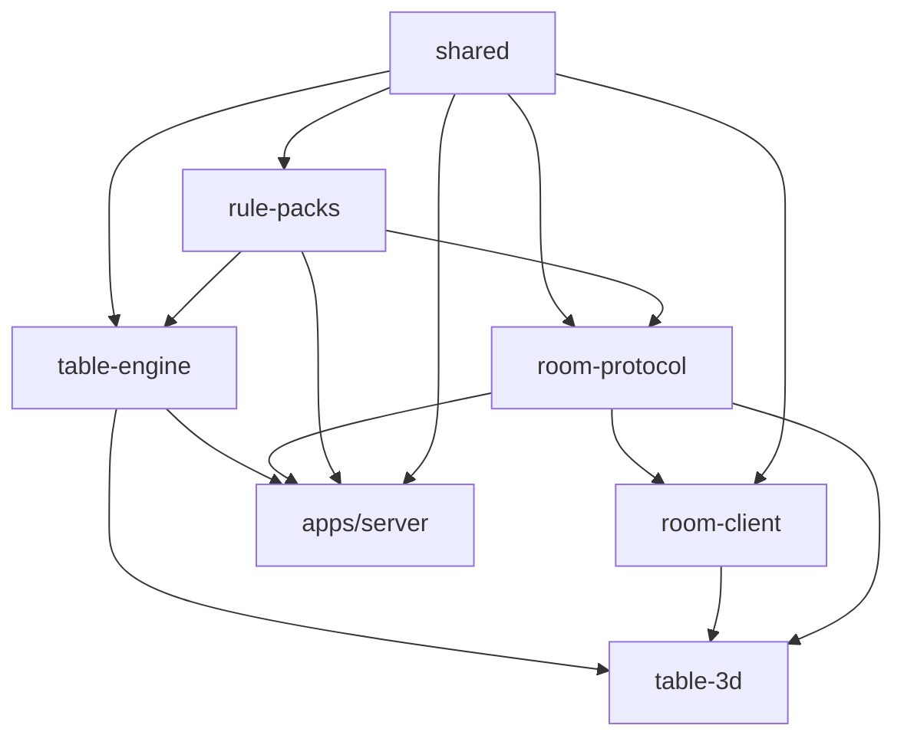
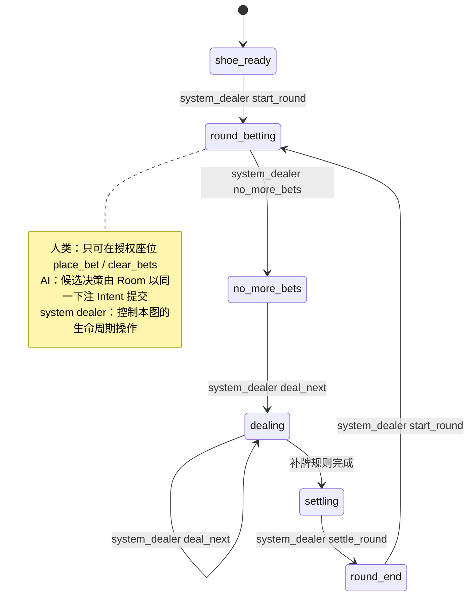
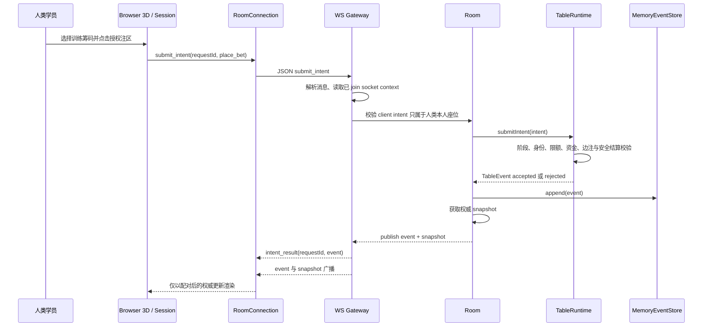
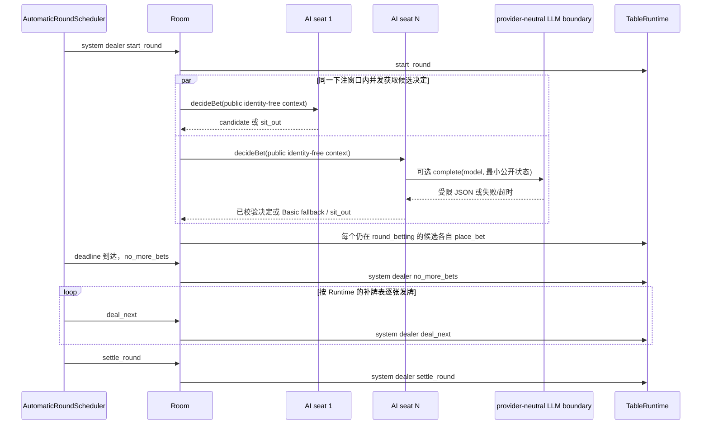
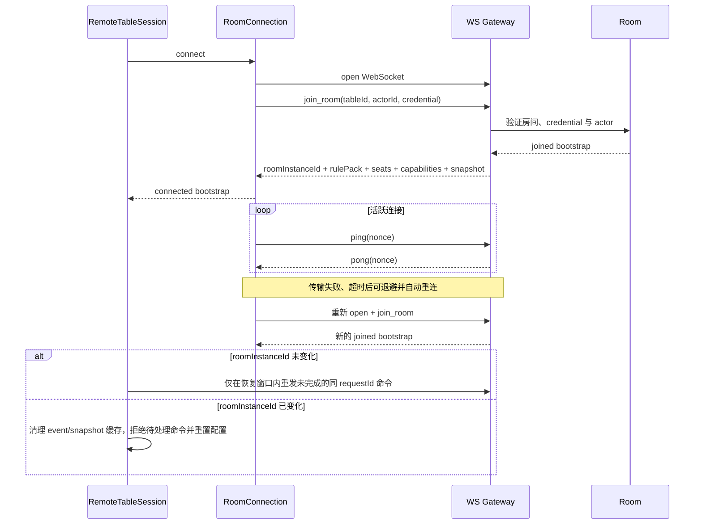
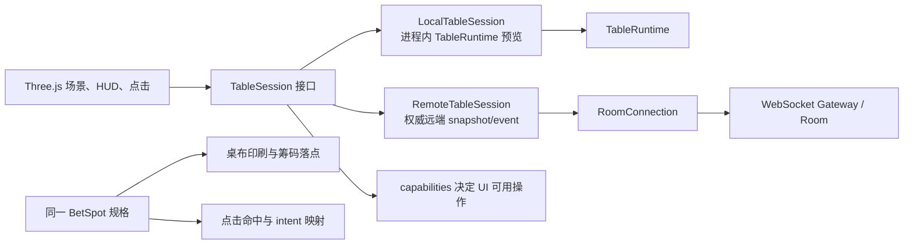
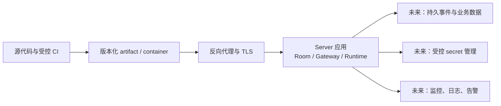

# 对局架构说明

> **文档状态：** 当前实现说明；能力范围截至 **2026-07-30**。本仓库在之后保留了本地验收记录，但本文不把路线图、设计规格或接口预留写成已经上线的能力。
>
> **适用读者：** 希望理解浏览器 3D 桌面、实时房间、百家乐规则引擎、AI 决策边界以及训练币账本如何协作的开发者、测试人员和培训设计人员。
>
> **重要边界：** 这是一个**非真钱**百家乐训练与软件验证项目。筹码没有现金价值；本文不构成生产系统设计、运营承诺、真实博彩服务或资金服务说明。

## 1. 架构目标与当前边界

当前代码把一局对局拆成可替换但职责明确的层：浏览器只负责呈现与提出请求，服务端房间与 `TableRuntime` 决定规则、阶段和账本，规则包定义可变桌规，事件和快照提供可审计的同步结果。这样可以让本地 3D 预览、远端 WebSocket 会话和测试注入的牌靴共享一套核心规则。

下图中的粗体说明了当前的权威链路。浏览器送出的不是状态写入，而是待验证的意图；浏览器动画、倒计时和本地缓存都不能改写权威结果。

### 1.1 明确的信任边界

- **浏览器到 Gateway：** 收到的 JSON、`actorId`、`seatId`、金额、阶段判断和 UI capability 都不可信。协议解析、已 join 的 socket 上下文、Room 授权和 Runtime 校验逐层收紧它们。
- **Gateway 到 Room：** Gateway 是薄传输层，不重算百家乐规则；它只在成功 join 后把请求交给目标 Room，并在 Room 发布更新时广播。
- **Room 到 Runtime：** Room 负责参与者、系统荷官和 AI 的编排；`TableRuntime` 才是阶段、下注、发牌、结算及账本状态的唯一裁决者。
- **Runtime 到事件/快照：** 每次提交都产生单调递增序号的 `TableEvent`，包括规则引擎拒绝的提交；快照是当前状态的非规范化视图。当前事件存储为内存实现，进程重启后不会保留历史。

## 2. Monorepo 职责与依赖方向

### 2.1 包责任矩阵

| 路径 | 当前责任 | 不能替代的责任 |
| --- | --- | --- |
| `packages/shared` | 卡牌、品牌化 ID、Intent、Event、Snapshot、阶段等共享领域类型 | 不执行规则，也不信任客户端输入 |
| `packages/rule-packs` | 规则包 schema、校验、加载和开发示例 | 不保存某一局的运行时状态 |
| `packages/table-engine` | 纯 TypeScript 的 `TableRuntime`、牌靴、补牌表、赔付、训练筹码账本 | 不打开 socket，不渲染 3D |
| `packages/room-protocol` | WebSocket 消息契约、运行时解析、协议版本、错误码 | 不做房间授权或对局结算 |
| `packages/room-client` | 浏览器 socket 生命周期、join、心跳、重连、消息分发 | 不把本地状态当作权威状态 |
| `packages/table-3d` | Three.js 桌面、注区、点击、动画和 local/remote session 适配 | 不在动画中直接结算或改账本 |
| `apps/server` | Room、内存事件库、自动回合、AI 边界和 WebSocket Gateway | 不把传输层当作规则引擎 |

箭头表示上层包可依赖下层类型或能力，不表示数据一定同步流动。尤其是 `table-3d` 的 local 模式会直接适配进程内 `TableRuntime`，而 remote 模式经由 `room-client` 使用服务端权威结果；两种模式共享 `TableSession` 表面，但不应混淆其权威边界。

## 3. 领域模型、身份与阶段

### 3.1 Intent、Event 与 Snapshot

| 概念 | 含义 | 关键规则 |
| --- | --- | --- |
| `TableIntent` | 一位 actor 希望执行的操作，例如 `place_bet`、`deal_next` | 是请求，不是事实；必须在当前阶段、角色、座位、限额和规则包下重新验证 |
| `TableEvent` | Runtime 对一次 Intent 的权威裁决 | 记录 `accepted`、拒绝原因（如有）、`seq`、规则包 ID/版本、阶段和可能的牌/结果 |
| `TableSnapshot` | 某个事件序号后的可读桌面状态 | 含阶段、座位筹码、已下注、已发牌、结果等，用于同步与渲染，不能由客户端自行提交 |

规则引擎拒绝的 Intent 同样会生成追加事件，因而“未接受”也有可观察的权威记录。相反，格式错误、未 join、身份不匹配等在 Gateway 层被拦截时，会收到协议错误而不会伪造为 Runtime 事件；它们没有形成有效对局操作。

### 3.2 重要 ID

| ID | 范围 | 用途 |
| --- | --- | --- |
| `tableId` | 逻辑桌 | 路由到 Room 与事件流 |
| `roomInstanceId` | 一次存活中的 Room incarnation | 区分同一逻辑桌被重建后的新实例，防止旧消息混入 |
| `roundId` | 一局 | 区分每次下注、发牌、结算循环 |
| `seq` | 一张桌的单调事件序号 | 配对 event/snapshot，排序与重放依据 |
| `actorId` | 操作主体 | Runtime 以其核验荷官、座位占用者或系统主体 |
| `seatId` | 桌内座位 | 把下注与训练筹码账本绑定到座位 |
| `requestId` | 客户端命令 | 支持幂等结果缓存、断线期间的有限重发与冲突检测 |
| `rulePackId` / `rulePackVersion` | 规则版本 | 让事件在当时的桌规语境下解释，而不是以后来的默认值复算 |

### 3.3 Rule Pack

Rule Pack 是“这张桌如何运行”的版本化输入：变体、下注限额、佣金或免佣参数、边注开关与赔率、牌靴配置等都应来自它。引擎不会把某家赌场的赔率写死为全局常量。进行中的 Runtime 持有创建时加载的包；文档中的开发示例不是对真实场所规则的声明。

### 3.4 阶段与权限

- 人类远端会话当前只有已授权 human actor 的下注与清注 capability；不能用 socket 取得荷官控制权。
- AI 不是特权规则路径：Room 为 AI 补入它自己的 `actorId` 和 `seatId` 后，仍向 Runtime 提交常规 `place_bet` Intent。
- 系统荷官是当前 demo Room 的 dealer。`start_round`、停注、逐张发牌、结算均由它执行；Runtime 也会拒绝不具此身份的操作。

## 4. 一次下注如何成为权威状态

`requestId` 在已连接的 `roomInstanceId` 和 actor 范围内关联请求结果。服务端会缓存结果以处理同一请求的有限重放，也会拒绝同一 ID 对应不同 Intent 的冲突。客户端显示“下注成功”应以 `intent_result` 的 `accepted` 为准，而不是以点击动画或发送成功为准。

若 Runtime 因错误阶段、未授权座位、下注上下限、余额不足、未开放边注或不安全金额而拒绝，它仍追加并发布拒绝事件及未改变的权威快照。这样所有已订阅客户端可以收敛到同一结果，而不是各自猜测本地失败原因。

## 5. 自动回合与 AI 决策

`AutomaticRoundScheduler` 只安排时间，不拥有百家乐规则。它从当前 phase 恢复或开始回合，保留下注窗口的 deadline，在截止时由系统荷官停注，随后逐张调用 Runtime 发牌并结算。任何当前 generation 的错误都会停止调度并报告，而不是继续驱动未知状态。

当前 Basic AI 只是可复现地选择一个合法的 Player 或 Banker 最低额训练下注。可选 LLM 路径是**供应商无关的边界**，不是已接入具体厂商：它只接收无身份的公开状态、要求严格 JSON、校验允许注种与金额，支持超时和 `AbortSignal`，失败时回退为 Basic AI 或本局不下注。Room 会缓存同一局每个 AI 的决定，避免调度恢复时重复请求或重复下注；下注窗口关闭、换局或 Room 停止会中止仍未完成的 AI 工作。

## 6. Remote 连接、重连与实例重置

这个流程应被理解为客户端韧性机制，而非“永不丢失”的分布式承诺：

- join 返回的是完整 bootstrap（规则包、座位、capabilities、snapshot 和 `roomInstanceId`），Remote session 以它替换本地描述信息。
- `RoomConnection` 使用 ping/pong 监测活性，并对暂时性连接故障进行带退避和抖动的重连；永久关闭和非暂时 join 拒绝会终止相应等待。
- Remote session 只会在恢复时间窗内尝试重发未完成命令，且复用原 `requestId`；这依赖服务端请求结果缓存，不能等同于完整事件历史重放。
- 新 `roomInstanceId` 代表逻辑桌的 live incarnation 已改变。客户端会丢弃旧缓存、通知配置变化，并拒绝旧实例中的 pending command，避免将旧 event/snapshot 拼接到新房间。
- 当前内存事件存储不提供跨进程、跨重启的持久回放保证。

## 7. 规则、资金与安全控制

### 7.1 规则与训练筹码

- **安全整数：** buy-in、下注、锁筹、赔付和最终余额都要求 JavaScript safe integer。金额还会在下注时预演所有可达结算场景，避免未来赔付产生不安全整数。
- **只开放规则包声明的边注：** Player、Banker、Tie 是主注；`player_pair` 和 `banker_pair` 仅在当前 Rule Pack 的 `sideBets` 中存在时可以被接受。赔率和免佣条件也从包读取。
- **先规划，后落账：** `TableRuntime` 先为整局所有下注建立并验证 `SettlementPlan`，聚合每座位的派彩并检查 ledger 能否承受，随后才应用计划。这个“全部验证后应用”是当前进程内对象的一致性行为，不是数据库事务或持久化原子提交。
- **账本语义：** 训练筹码从 free `stack` 移到本局 `locked`；结算清除 locked 并把返还额加回 stack。它不表示法币、支付、兑付或外部资产。

### 7.2 传输、身份与故障处理

- socket 成功连接或成功 join **不会**授予 `buy_in`、`cash_out`、荷官生命周期或 AI 座位权限。当前普通远端客户端只能在已授权的人类座位执行下注/清注；当前不存在通过 WebSocket 充值、提现或现金兑付的接口。
- join credential 由受信任的启动配置提供。浏览器远端配置仅接受应用加载前写入的内存对象；不要把 endpoint、身份或 credential 放入 query string，不要把 credential 写入日志或浏览器持久化存储。
- 开发环境的 credential 不是生产 secret。仓库不应包含生产密钥、真实访问令牌或目标部署凭据；生产化需要独立的 secret 管理与身份/授权设计。
- 不信任“客户端当前 phase”“当前余额”“可用注区”或“本地已成功动画”等任何断言。服务端 Runtime 每次重新验证。
- 当 Runtime 更新后，`MemoryEventStore.append` 失败时，Room 会标记为 faulted、终止 AI 决策，并拒绝之后的操作；调度器也会停止。这是防止内存 Runtime 与权威事件记录继续悄悄分叉的 fail-stop 行为。

### 7.3 LLM 数据最小化

可选 LLM 决策边界只构造阶段、回合标识、该 AI 的筹码、可下注种类、限额和公开结果/下注汇总；不把 AI 座位 actor 身份、credential 或客户端私密数据交给 provider。输出必须是受限 JSON 决定，遥测仅清洗过的模型、时延、结果、使用量与可选 provider request ID。任何具体 provider、成本控制、审计存储和生产数据协议仍是未来工作。

## 8. 3D 表现层与 Session 抽象

`TableSession` 让渲染层可以用相同方法读取座位、筹码、注区、规则包、快照和事件，并以相同订阅接口接收更新：

- **LocalTableSession：** 面向默认浏览器演示，包装一个进程内 Runtime。它便于开发和视觉测试，但不能代表远端服务端权威。
- **RemoteTableSession：** 使用 join bootstrap 的 seat、Rule Pack、capabilities 与 snapshot；配对同一序号的 event/snapshot 后才通知场景更新，并处理 reconnect 与 instance reset。
- **注区一致性：** 桌布印刷、筹码动画落点和 hit test 应来自同一 `BetSpot` 描述，避免“看起来可点”与“实际可点”不一致。现有 felt-mapping smoke 验证了座位区和 commission row 探针。
- **capabilities：** capability 只用于正确禁用或隐藏 UI 操作；实际授权仍由 Gateway、Room 和 Runtime 重复执行。

动画失败、网络延迟或画质降级时，表现层应以最新权威 snapshot 跳切到正确终态，而不是试图补写对局状态。

## 9. 测试、观测与当前证据

以下是截至本说明状态所引用的**本地实测**摘要，不是 CI，也不代表生产 SLA。完整环境、命令、警告边界与 smoke 说明见[本地验收记录](../development/validation-2026-07-29.md)。

| 检查 | 当前记录的结果 |
| --- | ---: |
| 全仓测试 | 35 个测试文件，**545** 个测试通过 |
| `@mct/server` | 11 个测试文件，**149** 个测试通过 |
| `@mct/table-3d` | 14 个测试文件，**181** 个测试通过 |
| `@mct/room-protocol` | 1 个测试文件，**67** 个测试通过 |
| `@mct/room-client` | 1 个测试文件，**45** 个测试通过 |
| workspace build | **7** 个 workspace 项目通过 |
| workspace typecheck | **7** 个 workspace 项目通过 |
| table-3d bundle warning | Vite 提示 **751.74 kB**，gzip **196.47 kB**，超过 500 kB warning 阈值 |

可观测性应围绕权威边界建立：记录并关联 `tableId`、`roomInstanceId`、`roundId`、`seq` 与 `requestId`，观察 join/重连、拒绝原因、Room fault、AI timeout/fallback、调度停止和 bundle 警告。日志与遥测不得记录 credential 或其他生产 secret。

## 10. 未来路线图（未实现）

下列项目是明确的后续方向，不是当前能力声明：

1. 用持久事件存储和可审计的回放替代 `MemoryEventStore`，并设计交易/发件箱语义。
2. 实现生产级认证、授权、用户/多人座位模型、secret 管理与审计策略。
3. 在 provider-neutral 接口外增加可选 LLM provider adapter，并补齐成本、速率限制、离线确定性测试、数据处理和审计。
4. 设计受控部署、监控、CI、备份和灾难恢复；同时用 code splitting/manual chunks 降低 table-3d bundle 警告。

### 10.1 预期部署形态（前瞻图，不是已部署拓扑）

图中没有指定真实目标主机、网络地址或凭据。任何实际部署都应在独立的安全评审、合法合规审查和运维设计之后进行。

## 11. 术语表

| 术语 | 简明定义 |
| --- | --- |
| 权威状态 | 由服务端 Runtime 根据规则包裁决并发布的状态；客户端只能呈现 |
| Intent | 对局操作请求，尚未被接受时不改变对局事实 |
| Event | 一次 Intent 的追加裁决，接受与拒绝都可被记录 |
| Snapshot | 当前桌面状态的完整读模型，用于同步和渲染 |
| Rule Pack | 版本化桌规、限额、变体、边注与赔率配置 |
| Room | 包装一个 Runtime 的服务端存活房间，负责参与者、AI、存储与更新发布 |
| system dealer | 当前 demo 中驱动回合生命周期的服务端主体 |
| room incarnation | `roomInstanceId` 所代表的一次 live Room 实例；重建后不同于旧实例 |
| training chips | 仅用于训练账本的整数筹码，不是现金或可兑资产 |

## 12. 延伸阅读

- [仓库 README](../../README.md)
- [百家乐新手训练指南](../guides/baccarat-beginner-guide.md)
- [当前进度与提交基线](../development/current-progress.md)
- [本地验收记录（非 CI）](../development/validation-2026-07-29.md)
- [Phase 0-1 设计规格](../superpowers/specs/2026-07-27-macau-casino-training-design.md)
- [开发 Rule Pack 示例](../../packages/rule-packs/packs/dev/generic-macau-baccarat.v1.json)
